# scrolling\_strategist

Maybe a thing that might be functional one day, and if it is, it will help you
to scroll your items wisely.

## How it works

### Input

scrolling\_strategist takes, as its input, the following things:

- An initial equipment item, defined by:
    - How many slots the item has remaining.
    - What (relevant) stats the item has, represented as a [row
      vector](https://en.wikipedia.org/wiki/Row_and_column_vectors) of numbers.
      Each [index](https://en.wikipedia.org/wiki/Index_notation) (i\.e. column)
      of the vector corresponds to a certain type of stat, e\.g. WATK.
- A non[empty](https://en.wikipedia.org/wiki/Empty_set) [set][set] of scrolls,
  representing the set of all kinds of scrolls that could be applied to the
  item. Each scroll is defined by:
    - Its [probability of
      success](https://en.wikipedia.org/wiki/Bernoulli_process).
    - Whether or not it is a dark scroll. A dark scroll with a success
      probability of 𝑝 has a ½(1 − 𝑝) probability of failing in the way that
      a non-dark scroll does (doing nothing to the item other than removing one
      of its slots; we call this a “miss”), and a ½(1 − 𝑝) probability of
      destroying the equipment item outright (we call this a “boom”).
    - The cost of obtaining an individual such scroll, represented as an
      [extended real](https://en.wikipedia.org/wiki/Extended_real_number_line)
      number. This is usually taken to be a specifically _meso_ cost, but it
      can be any measurement of “cost”, so long as the measurement is the same
      for all scrolls.
    - What (relevant) stats the scroll confers to an equipment item upon
      success. Like the stats of an item, this is represented as a row vector
      of numbers, in which each index (i\.e. column) of the vector corresponds
      to a certain type of stat, e\.g. WATK. All scrolls must make their
      indices (viz. which indices correspond to which stats) consistent with
      the indices used by equipment item stats.
- The goal stats (desired stats for the item), represented in the same way that
  item stats are represented. It’s assumed that _every_ index of the goal
  vector must be met (or exceeded) in order for the goal to be met.

Note that because of how scrolls are represented, Clean Slate Scrolls (CSS),
Chaos Scrolls (CS), White Scrolls (WS), etc. cannot be represented.

### Optimisation modes

Currently, scrolling\_strategist only has one mode. This mode **only** attempts
to maximise the
[probability](https://en.wikipedia.org/wiki/Marginal_distribution) of reaching
the goal. As a result, this mode:

- **Cannot** take into account scroll costs to guide its decisions, unless the
  scroll costs are needed to break a tie.
- **Cannot** take into account the cost of the initial item, because that
  information is not supplied.
- Will, in practice (i\.e. using actual scrolls that exist in some version of
  MapleStory), never tell you to use 10% scrolls, unless 30% scrolls don’t
  exist. This is because 10% scrolls and 30% scrolls confer the same stats when
  they succeed, and the 30% scroll’s thrice-as-large likelihood of succeeding
  overwhelms the downside of the 35% boom probability. The exception is when
  you’ve already reached your goal, and you have \>0 slots remaining, and 10%
  scrolls are the cheapest variety of scroll. In this case, the optimiser can’t
  distinguish between non-dark scrolls; the only way to fail at this point is
  to boom, so using any non-dark scroll maximises the probability of success
  (to a probability of 1).

### The optimiser

The optimiser uses a fairly straightforward application of [dynamic
programming](https://en.wikipedia.org/wiki/Dynamic_programming) methodology. At
its core, the optimiser is imposing a certain<sup>\[1\]</sup>
[semimodule](https://en.wikipedia.org/wiki/Semimodule) onto a [tree][tree] of
possible scrolling routes, where distinct subtrees are sometimes identical
(value-wise) to one another. This subtree overlap is an example of what is
called “overlapping subproblems”, in the context of dynamic programming.

The problem at hand has (again, in dynamic programming terminology) “[optimal
substructure](https://en.wikipedia.org/wiki/Optimal_substructure)”, because if
we already know the optimal scrolling strategy beyond a certain scroll usage,
then we can easily decide what scroll to use at that point. All that we have to
do is rank each possible scroll choice by a [weighted
sum](https://en.wikipedia.org/wiki/Linear_combination) of probabilities of
reaching the goal, and then pick whichever scroll ranks the highest. In the
phrase “weighted sum of probabilities of reaching the goal”, each “weight”
(coefficient) is the probability of getting that particular scroll outcome
(probability of succeeding the scroll, of missing the scroll, of booming with
the scroll), and each term is the probability of reaching your goal, assuming
that you get that particular scroll outcome, and assuming optimal scrolling
strategy from then onwards. For example, if you have a 20% chance of reaching
your goal after succeeding a 60% scroll, and a 10% chance of reaching your goal
after missing a 60% scroll, then the weighted sum of probabilities of reaching
the goal — given that you decide to use a 60% scroll — is
(60% ⋅ 20%) + (40% ⋅ 10%) = 16%.

The internal logic of the optimiser is more easily seen with an example.

#### Example

Consider a average clean [Toy of
101](https://maplelegends.com/lib/equip?id=1402038), which has 3 STR, 3 DEX, 92
WATK, and 7 slots. Because we’re going to scroll for WATK, we only care about
the WATK and the STR. So, we can represent its starting stats as the row vector
\[92, 3\], where the first column represents the WATK, and the second column
represents the STR. Then, the set of scrolls that we want to consider using
includes 10% scrolls, 30% scrolls, 60% scrolls, 70% scrolls, and 100% scrolls
(all for two-handed sword for WATK). And finally, let’s say that our goal is
\[108, 10\] — in other words, at least 108 WATK, _and_ at least 10 STR.

[scroll\_strategist\_cli](https://codeberg.org/deer/scroll_strategist_cli) (a
frontend for scroll\_strategist) accepts
[JSON](https://en.wikipedia.org/wiki/JSON) input in a certain format. Using
said format, we can represent the input like so (the costs are rough estimates
of free-market meso costs in MapleLegends as of this writing):

```json
{
  "slots": 7,
  "stats": [92, 3],
  "scrolls": [
    { "percent":  10, "dark": false, "cost":  100000, "stats": [5, 3] },
    { "percent":  30, "dark": true,  "cost": 1300000, "stats": [5, 3] },
    { "percent":  60, "dark": false, "cost":   50000, "stats": [2, 1] },
    { "percent":  70, "dark": true,  "cost":   35000, "stats": [2, 1] },
    { "percent": 100, "dark": false, "cost":   70000, "stats": [1, 0] }
  ],
  "goal": [108, 10]
}
```

With this input, the optimiser will then perform a [depth-first search
(DFS)][dfs] of the tree mentioned above. This tree is constructed in
[memory](https://en.wikipedia.org/wiki/Computer_memory) _only as needed_, and
subtrees that are known to be suboptimal are pruned as they are discovered. The
diagrams below illustrate a (small portion of a) pruned tree:

<details>
<summary>Legend</summary>


</details>



Within the “scroll usage” (hexagonal) nodes:

- “**P(goal)**” refers to the probability of reaching the goal, given that this
  scroll is chosen, but **not** assuming any particular outcome of the scroll.
- “**E\[cost\]**” refers to the
  [expected](https://en.wikipedia.org/wiki/Expected_value) cost (due _solely_
  to scroll expenditure) incurred due to this scroll being used, in addition to
  all future scrolls used. Costs of scrolls that were already used in the past
  are not considered.

As you’d expect, the scroll that the optimiser chooses to use at any given
point is just the scroll that yields [the
largest](https://en.wikipedia.org/wiki/Maxima_and_minima) associated
“**P(goal)**”.

Because — as mentioned before — certain distinct subtrees are value-wise
identical (“overlapping subproblems”), the most important optimisation to this
DFS is simply keeping a [memo
(cache)](https://en.wikipedia.org/wiki/Memoization). This cache
[maps](https://en.wikipedia.org/wiki/Hash_table) item states (slots & stats) to
their corresponding subtrees, so that those subtrees never have to be
re-generated/searched again. Thus, only one copy of each subtree is kept
in-memory. This is a _massive_ [time
complexity](https://en.wikipedia.org/wiki/Time_complexity) reduction, and
probably also a massive [space
complexity](https://en.wikipedia.org/wiki/Space_complexity) reduction as well.

Furthermore, another (smaller) performance optimisation is the so-called
“master scroll” optimisation. The master scroll optimisation generates a
“master scroll” before initiating the DFS. The master scroll is a _purely
theoretical_ scroll that has a 100% probability of success, and grants a bonus
to each stat that is equal to the highest bonus granted to that stat by any of
the scrolls in the input set<sup>\[2\]</sup>. When considering what scroll to
use next, we can first check whether or not we would reach our goal by using
the master scroll on all remaining slots. If the answer is “no, the goal would
still not be reached”, then we know that reaching the goal is simply
impossible, and we can give up right away.

<details>
<summary>Footnotes for “The optimiser”</summary>

\[1\]: We’ll call the [semiring](https://en.wikipedia.org/wiki/Semiring)
underlying this semimodule “𝑅”. 𝑅 has, as its underlying set, the [unit
interval (ℐ)](https://en.wikipedia.org/wiki/Unit_interval), because its members
are probabilities (of getting a certain outcome after using a given scroll, or
of reaching the goal). Its additive
[operation](https://en.wikipedia.org/wiki/Binary_operation) is the
“[𝗆𝖺𝗑](https://en.wikipedia.org/wiki/Maxima_and_minima)” operation, which
takes in two [real numbers](https://en.wikipedia.org/wiki/Real_number), and
yields the larger (the **max**imum) of the two numbers. Its multiplicative
operation is just ordinary multiplication of real numbers (∗). So then, our
semiring 𝑅 is:

<div style="text-align:center;font-size:larger;">

𝑅 ≝ (ℐ, 𝗆𝖺𝗑, ∗).

</div>

To show that this is in fact a semiring, we can prove that it satisfies the
semiring axioms ([for
any](https://en.wikipedia.org/wiki/Universal_quantification) 𝑎, 𝑏, 𝑐 ∈ ℐ):

- (ℐ, 𝗆𝖺𝗑) is an
  [abelian](https://en.wikipedia.org/wiki/Commutative_property)
  [monoid](https://en.wikipedia.org/wiki/Monoid) with an
  [identity](https://en.wikipedia.org/wiki/Identity_element) called 0:
    - ℐ is [closed][closure] under 𝗆𝖺𝗑. The larger of two elements of ℐ has to
      be… an element of ℐ.
    - 𝗆𝖺𝗑 is
      [associative](https://en.wikipedia.org/wiki/Associative_property):
      𝗆𝖺𝗑{𝗆𝖺𝗑{𝑎, 𝑏}, 𝑐} = 𝗆𝖺𝗑{𝑎, 𝗆𝖺𝗑{𝑏, 𝑐}} = 𝗆𝖺𝗑{𝑎, 𝑏, 𝑐}.
    - 𝗆𝖺𝗑{𝑎, 0} = 𝑎 for any 𝑎 ∈ ℐ, because 0 is the unique minimum
      element of ℐ — anything is at least as large as 0. So 0 is the identity
      of 𝗆𝖺𝗑.
    - 𝗆𝖺𝗑 is commutative: 𝗆𝖺𝗑{𝑎, 𝑏} = 𝗆𝖺𝗑{𝑏, 𝑎}.
- (ℐ, ∗) is a monoid with an identity called 1:
    - ℐ is [closed][closure] under ∗. Multiplying two numbers in the unit
      interval can never yield a number greater than 1, as multiplying by a
      number in the unit interval can’t make a number larger — at best, you can
      just not change its value (by multiplying by 1). Similarly, multiplying
      two numbers in the unit interval can never yield a number less than 0, as
      none of the elements of the unit interval are
      [negative](https://en.wikipedia.org/wiki/Negative_number).
    - ∗ is [associative](https://en.wikipedia.org/wiki/Associative_property);
      it inherits this property from ordinary multiplication of real numbers.
    - 1 is the identity element: 1 ∗ 𝑎 = 𝑎 = 𝑎 ∗ 1.
    - ∗ is commutative; it inherits this property from ordinary multiplication
      of real numbers.
- ∗ [left-distributes and
  right-distributes](https://en.wikipedia.org/wiki/Distributive_property) over
  𝗆𝖺𝗑:
    - 𝑎 ∗ 𝗆𝖺𝗑{𝑏, 𝑐} = 𝗆𝖺𝗑{𝑎 ∗ 𝑏, 𝑎 ∗ 𝑐}. Multiplying by a larger
      nonnegative real number always gets you a larger result.
    - 𝗆𝖺𝗑{𝑎, 𝑏} ∗ 𝑐 = 𝗆𝖺𝗑{𝑎 ∗ 𝑐, 𝑏 ∗ 𝑐}. This follows from the
      above, combined with the commutativity of ∗.
- Multiplication by 0
  [annihilates](https://en.wikipedia.org/wiki/Absorbing_element) 𝑅:
  0 ∗ 𝑎 = 0 = 𝑎 ∗ 0.

And 𝑅 really is just a semiring, and not a [ring][ring], because inverse
elements for 𝗆𝖺𝗑 are not possible.

To build a semimodule on top of our semiring 𝑅, we introduce an abelian monoid
𝑀:

<div style="text-align:center;font-size:larger;">

𝑀 ≝ (ℐ<sup>3</sup>, 𝗆𝖺𝗑<sup>3</sup>).

</div>

ℐ<sup>3</sup> is just
ℐ [×](https://en.wikipedia.org/wiki/Cartesian_product) ℐ × ℐ, i\.e. a
[triple](https://en.wikipedia.org/wiki/Tuple) (𝑎, 𝑏, 𝑐) for some
𝑎, 𝑏, 𝑐 ∈ ℐ. Alternatively, we can write each element as a row vector:
\[𝑎, 𝑏, 𝑐\]. And 𝗆𝖺𝗑<sup>3</sup> is just 𝗆𝖺𝗑 applied component-wise:

<div style="text-align:center;font-size:larger;">

𝗆𝖺𝗑<sup>3</sup>{\[𝑎, 𝑏, 𝑐\], \[𝑑, 𝑒, 𝑓\]} ≝
\[𝗆𝖺𝗑{𝑎, 𝑑}, 𝗆𝖺𝗑{𝑏, 𝑒}, 𝗆𝖺𝗑{𝑐, 𝑓}\].

</div>

Then, we introduce the “[scalar
multiplication](https://en.wikipedia.org/wiki/Scalar_multiplication)” operation
(⋅):

<div style="text-align:center;font-size:larger;">

𝑎 ⋅ \[𝑏, 𝑐, 𝑑\] ≝ \[𝑎 ∗ 𝑏, 𝑎 ∗ 𝑐, 𝑎 ∗ 𝑑\].

</div>

This means that (⋅) is defined more or less identically to scalar
multiplication over ℝ<sup>3</sup>.

Then, our semimodule 𝑆<sub>𝑅</sub> is just:

<div style="text-align:center;font-size:larger;">

𝑆<sub>𝑅</sub> ≝ (𝑅, 𝑀, ⋅).

</div>

To prove that this really is a semimodule, we can show that it satisfies the
semimodule axioms (for any 𝑣, 𝑤 ∈ 𝑀):

- 𝑎 ⋅ 𝗆𝖺𝗑<sup>3</sup>{𝑣, 𝑤} = 𝗆𝖺𝗑<sup>3</sup>{𝑎 ⋅ 𝑣, 𝑎 ⋅ 𝑤}. This
  follows from the combination of 𝑅 being a semiring (particularly the
  distributive property), with both 𝗆𝖺𝗑<sup>3</sup> and (⋅) being defined
  component-wise.
- 𝗆𝖺𝗑{𝑎, 𝑏} ⋅ 𝑣 = 𝗆𝖺𝗑<sup>3</sup>{𝑎 ⋅ 𝑣, 𝑏 ⋅ 𝑣}. This also follows
  from the combination of 𝑅 being a semiring (particularly the distributive
  property), with both 𝗆𝖺𝗑<sup>3</sup> and (⋅) being defined component-wise.
- (𝑎 ∗ 𝑏) ⋅ 𝑣 = 𝑎 ⋅ (𝑏 ⋅ 𝑣). This follows from the associativity of ∗,
  and the fact that (⋅) is defined in terms of ∗.
- 1 ⋅ 𝑣 = 𝑣. This follows from 1 being the identity element of ∗.
- 0<sub>𝑅</sub> ⋅ 𝑣 = 𝑎 ⋅ 0<sub>𝑀</sub> = 0<sub>𝑀</sub> = \[0, 0, 0\].
  This follows from 0 being the annihilating element of ∗.

The whole reason why we want the 𝗆𝖺𝗑 (and thus also 𝗆𝖺𝗑<sup>3</sup>)
operation is because this is the operation that we apply to choose between one
or more competing strategies. Whichever one maximises the probability of
reaching the goal is the chosen strategy. And our ∗ (and thus also ⋅) operation
corresponds to the fact that, for any two [independent][independence]
[events][event] 𝑒<sub>1</sub> [⫫][independence] 𝑒<sub>2</sub>,

<div style="text-align:center;font-size:larger;">

[𝖯][p](𝑒<sub>1</sub> [∩][intersection] 𝑒<sub>2</sub>) =
𝖯(𝑒<sub>1</sub>) ∗ 𝖯(𝑒<sub>2</sub>).

</div>

Independence is guaranteed by the fact that every scroll application is a
totally independent event — independent of everything, unless you happen to
know the internal state of the server’s
[PRNG](https://en.wikipedia.org/wiki/Pseudorandom_number_generator)…!

Using a given scroll yields three possible outcomes (technically, not all are
necessarily “possible”; some may have probability 0, [so long as the sum of all
three is 1](https://en.wikipedia.org/wiki/Law_of_total_probability)):

- Success.
- Miss.
- Boom.

Each one of these outcomes yields some equip as a result (or no equip at all,
in the case of a boom), and we can look ahead to see what the probability is of
reaching our goal, given some yielded equip (and given the optimal scrolling
strategy). So, each one of these outcomes has two probabilities attached to it:
the probability that the outcome happens at all (e\.g. 40% for a “miss” of a
60% scroll), and the probability of reaching the goal, given that the outcome
does happen. We can aggregate the outcome probabilities into an element
𝑜 ∈ ℐ<sup>3</sup> (e\.g. 𝑜 = \[0\.3, 0\.35, 0\.35\] for a 30% scroll), and
the corresponding goal-reaching probabilities into another element
𝑔 ∈ ℐ<sup>3</sup>. Then, the overall probability of reaching the goal by using
this scroll is just the [dot
product](https://en.wikipedia.org/wiki/Dot_product) ⟨𝑜, 𝑔⟩ of these two
vectors:

<div style="text-align:center;font-size:larger;">

<!-- markdownlint-disable line-length -->

⟨𝑜, 𝑔⟩ ≝ (𝑜<sub>1</sub> ∗ 𝑔<sub>1</sub>) + (𝑜<sub>2</sub> ∗ 𝑔<sub>2</sub>) + (𝑜<sub>3</sub> ∗ 𝑔<sub>3</sub>).

<!-- markdownlint-enable line-length -->

</div>

This yields an element of 𝑅 (i\.e. an element of ℐ), which we can then do more
semiring-y things with. Do note that when defining ⟨□, △⟩, we’re using ordinary
addition of real numbers, _not_ 𝗆𝖺𝗑. This is because we don’t have a choice
in which scroll outcome we get; we can only decide which scroll to use, and
RNGsus does the rest. So, the best that we can do is calculate an
[expectation](https://en.wikipedia.org/wiki/Expected_value).

\[2\]: Think 𝗆𝖺𝗑<sup>3</sup>, but more like 𝗆𝖺𝗑<sup>𝑛</sup>, where 𝑛 is
the number of columns/indices in the stat vectors. The stat vector of the
master scroll is 𝗆𝖺𝗑<sup>𝑛</sup> of the stat vectors of all of the scrolls
in the input set.

</details>

[set]: https://en.wikipedia.org/wiki/Set_(mathematics)
[tree]: https://en.wikipedia.org/wiki/Tree_(graph_theory)
[dfs]: https://en.wikipedia.org/wiki/Depth-first_search
[closure]: https://en.wikipedia.org/wiki/Closure_(mathematics)
[ring]: https://en.wikipedia.org/wiki/Ring_(mathematics)
[intersection]: https://en.wikipedia.org/wiki/Intersection_(set_theory)
[independence]: https://en.wikipedia.org/wiki/Independence_(probability_theory)
[event]: https://en.wikipedia.org/wiki/Event_(probability_theory)
[p]: https://en.wikipedia.org/wiki/Probability

## legal

[AGPL v3](https://www.gnu.org/licenses/agpl-3.0)+
